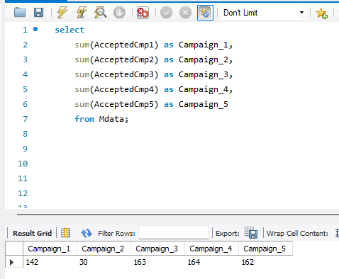
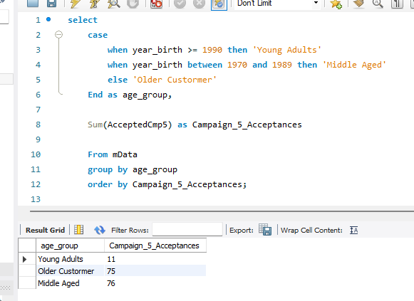
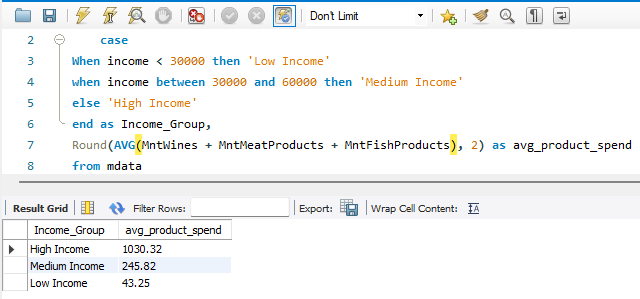
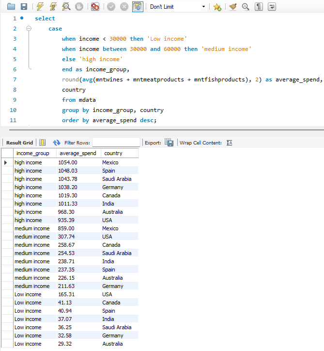

# Marketing Data Analysis Dashboard

## Project Overview
This project analyses customer behaviour, purchasing trends, and marketing campaign performance using SQL and Power BI.

The analysis focuses on:
- Marketing campaign performance
- Customer demographics
- Product spending behaviour
- Customer segmentation
- Purchasing trends

The goal of this project is to develop practical business analysis skills through real-world marketing data while improving SQL querying, analytical thinking, and dashboard reporting capabilities.

---

## Dataset Information

The dataset contains customer demographic information, purchasing behaviour, and campaign response data.

| Column Category | Description |
|---|---|
| Customer Demographics | Age, education, marital status, income, country |
| Household Information | Children and teenagers in household |
| Product Spending | Wine, meat, fruit, fish, sweets, gold products |
| Purchasing Channels | Web, catalog, and in-store purchases |
| Marketing Campaigns | Customer acceptance of Campaigns 1–5 |
| Customer Engagement | Web visits, recency, complaints, campaign response |

---

## Business Questions

1. Which marketing campaign achieved the highest acceptance performance?
2. Which customer demographics generate the highest spending?
3. Which purchasing channel is most popular among customers?
4. Which product categories generate the highest customer spending?
5. Do higher-income customers respond more positively to marketing campaigns?

---

## SQL Skills Demonstrated

- Aggregate Functions (`SUM`, `AVG`, `COUNT`)
- Filtering with `WHERE`
- Grouping with `GROUP BY`
- Sorting with `ORDER BY`
- Customer Segmentation using `CASE WHEN`
- Business Metric Analysis
- Demographic Segmentation
- Campaign Performance Analysis

---

## Question 1 — Marketing Campaign Performance

### SQL Query
(Campaign_age_demographic.png)

### Supporting Demographic Analysis

### Key Insights
Marketing campaigns 3, 4, and 5 achieved the strongest acceptance performance, with all three recording very similar customer acceptance totals.

Campaign 1 also performed relatively well with 142 acceptances, while Campaign 2 significantly underperformed compared to all other campaigns, recording only 30 acceptances.

Further demographic analysis showed that campaign engagement was consistently strongest among older and middle-aged customers, while younger adults recorded substantially lower engagement across all campaigns. This suggests future marketing efforts may benefit from strategies more specifically targeted toward younger customer segments.

---

## Question 2 — Which Customer Demographics Generate the Highest Spending?

### Income Group Spending Analysis

### Country Spending Comparison

### Key Insights
Analysis indicates that average spending was highest among high-income customers, followed by medium-income and low-income groups. This suggests purchasing behaviour is strongly influenced by income level, with higher-income customers contributing substantially greater product spending.

Cross-country analysis revealed relatively consistent spending patterns across most regions. However, Mexico recorded notably strong spending behaviour among medium-income customers (£859), significantly outperforming comparable demographics in other countries.

These findings may suggest stronger product engagement or purchasing power within Mexico’s medium-income customer segment and could provide useful insight for future regional marketing strategies.

---

## Tools Used

- SQL
- Power BI
- GitHub
- Excel

---

## Power BI Dashboard

Power BI dashboard screenshots and visual analysis will be added upon completion of the dashboard build.

---

## Author

Created as part of a personal Data Analytics portfolio project focused on developing practical SQL, business intelligence, and customer analytics skills.# Marketing_Data_Analysis_Dashboard
SQL Analysis project exploring Marketing trends and sales patterns
